# Bloc 20 — Validació final i preparació del pilot

Data de la validació tècnica: 15/07/2026

## Veredicte

El flux principal està tècnicament preparat per passar a una prova supervisada amb un grup petit. Això no equival a donar el pilot per completat: encara cal provar Safari en un iPad físic, fer les comprovacions assistides d'accessibilitat i observar alumnes reals durant 6–8 setmanes.

## Recorregut auditat

1. **Inici buit — correcte.** La pantalla no crea urgència fictícia i ofereix un següent pas clar.

   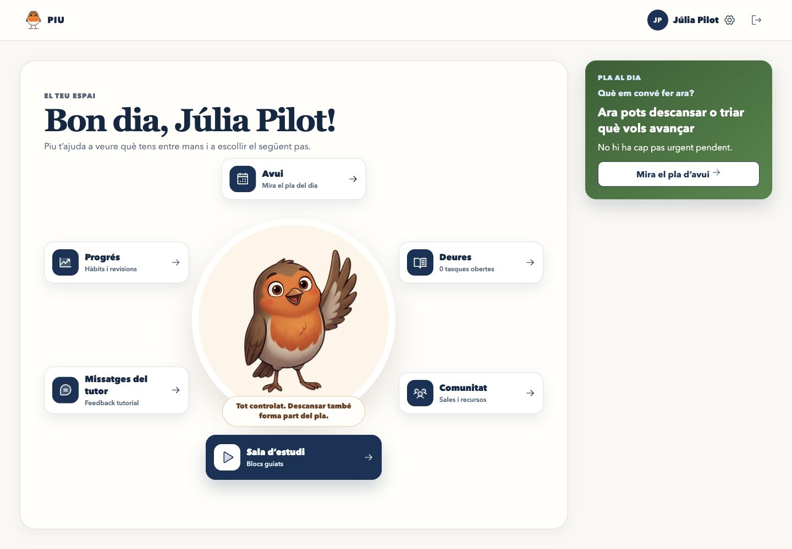

2. **Apuntar una tasca — correcte.** El formulari permet crear-la sense haver de decidir tota la planificació al mateix moment.

   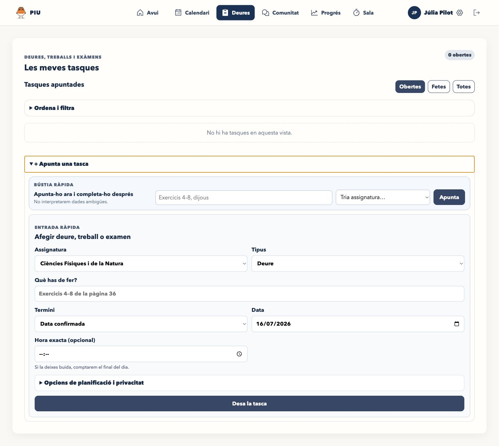

3. **Planificar-la — correcte després d'una correcció.** Es va detectar que l'avís «Planifica-la ara» continuava visible després de planificar; ara només apareix mentre la tasca encara no està planificada.

   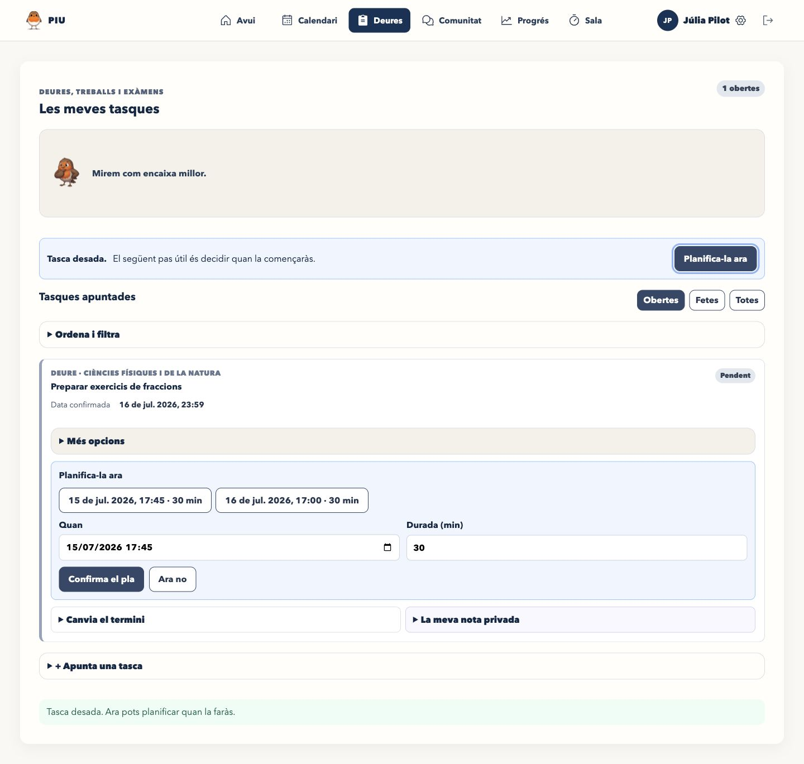

4. **Consultar Avui i Calendari — correcte.** La mateixa tasca conserva títol, termini i sessió. La setmana buida no inventa càrrega i la setmana normal mostra la disponibilitat i els conflictes.

   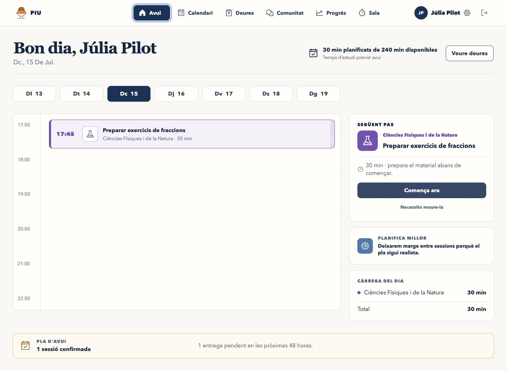

   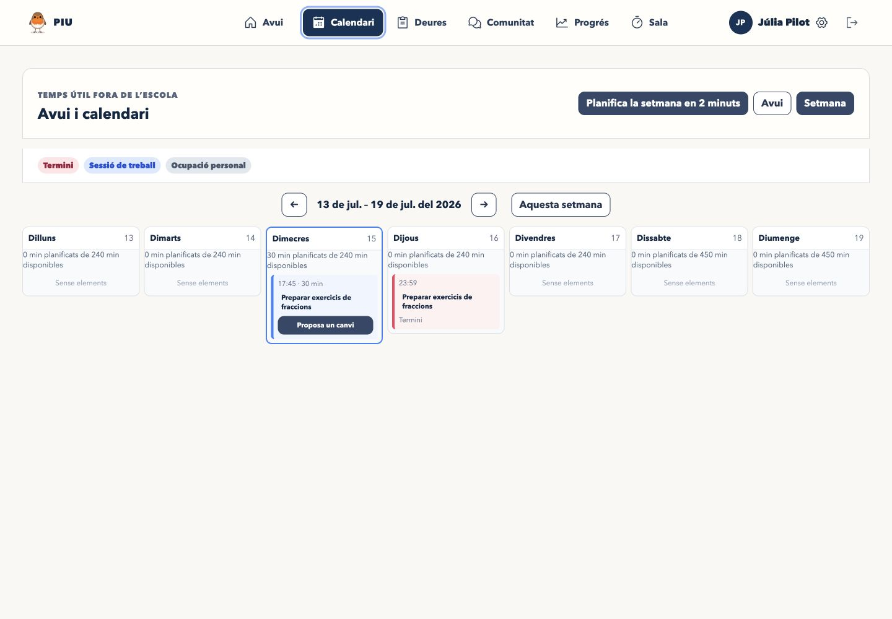

5. **Planificar la setmana en 2 minuts — correcte tècnicament.** La proposta no escriu canvis fins que l'alumne confirma. En el cas capturat, totes les tasques ja estaven planificades. Falta mesurar amb alumnes si realment redueix temps, errors i sensació de càrrega.

   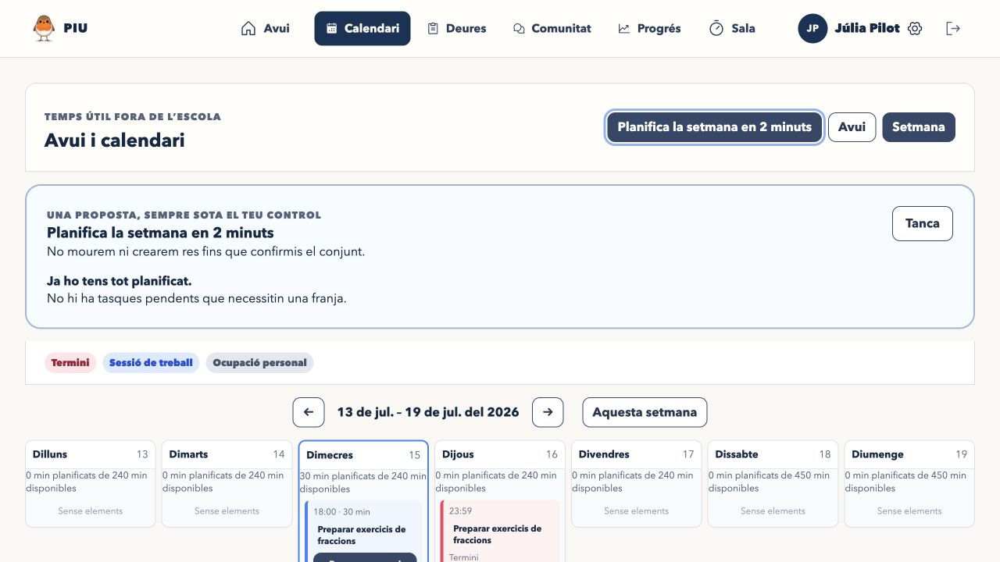

6. **Preparar i iniciar l'estudi — correcte.** La Sala selecciona la pròxima tasca recomanada, permet triar una sessió curta i, durant el focus, elimina navegació i distraccions.

   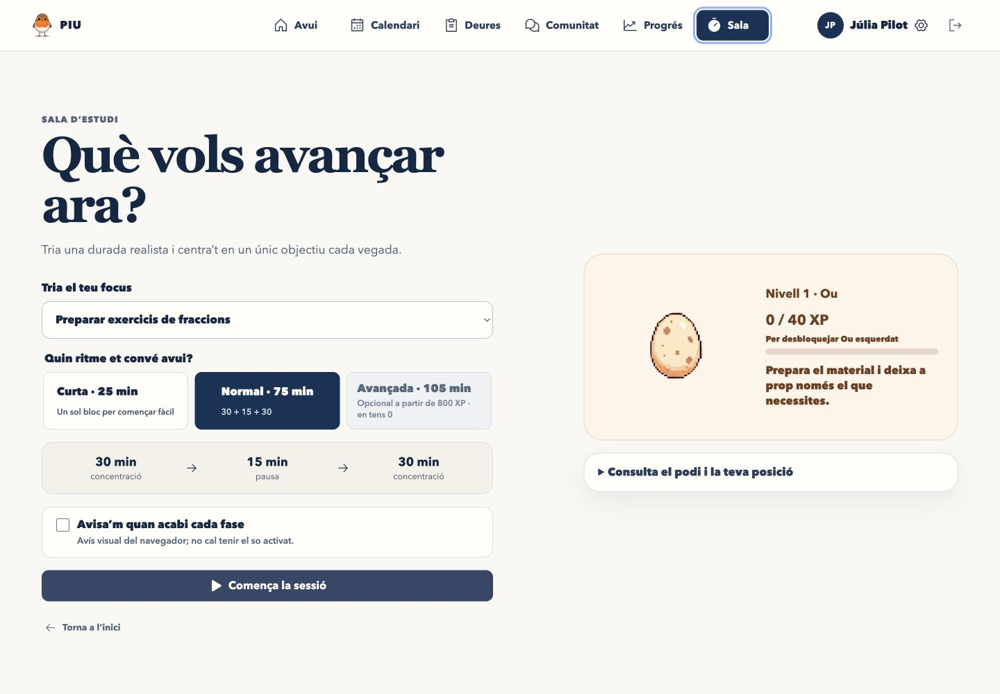

   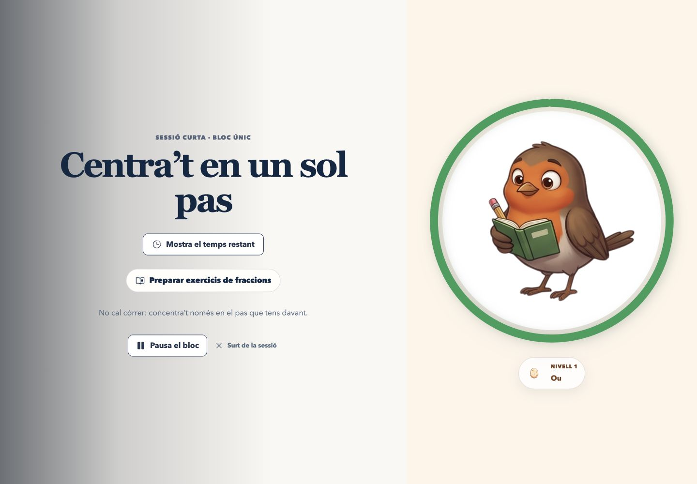

7. **Adaptació a iPad — correcta en simulació.** No s'ha detectat desbordament horitzontal a 768 × 1024 ni a 1024 × 768. Encara falta la prova en Safari sobre un iPad físic.

   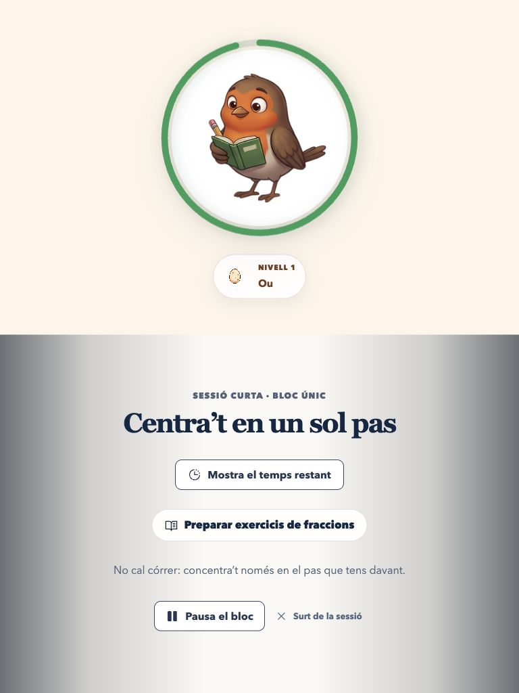

   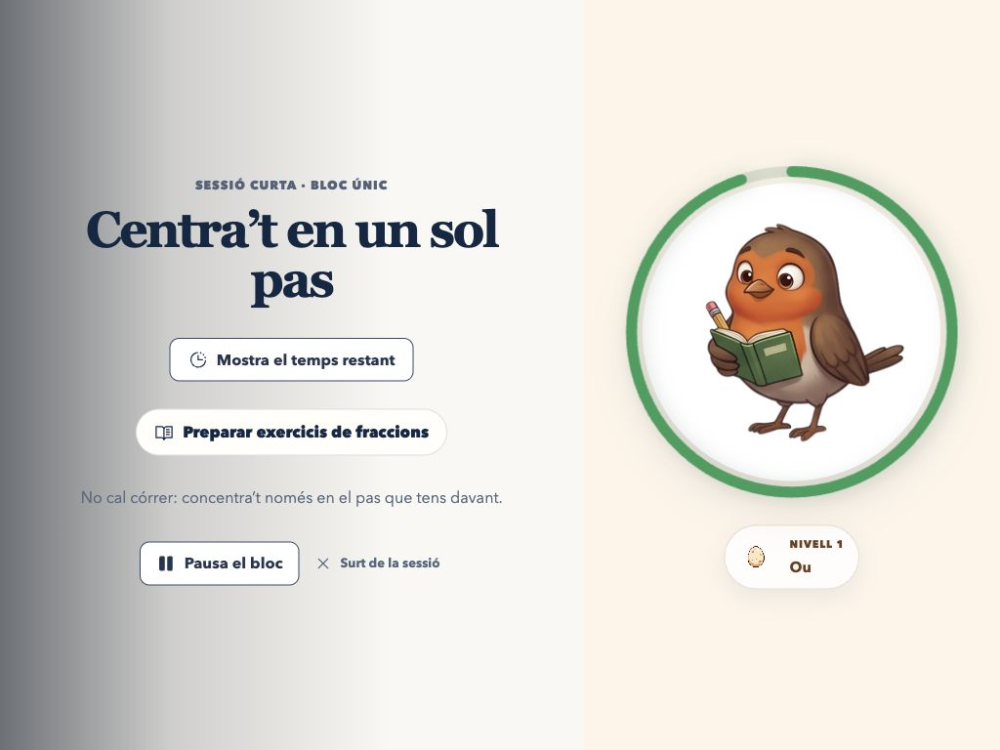

8. **Vista del tutor — correcta després d'una correcció.** El tutor entra a la mateixa vista de l'alumne en mode de només lectura. S'ha traduït l'estat de la tasca i s'hi ha afegit data, hora i durada de la pròxima sessió.

   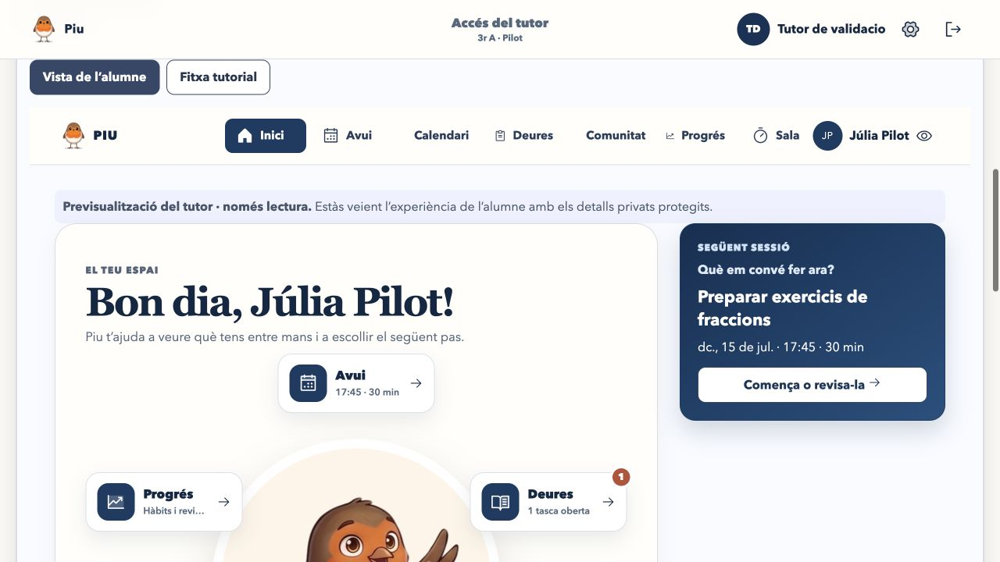

9. **Revisar, reajustar o demanar ajuda — correcte.** La revisió setmanal permet registrar el resultat, moure la tasca i deixar constància que es vol parlar amb el tutor.

   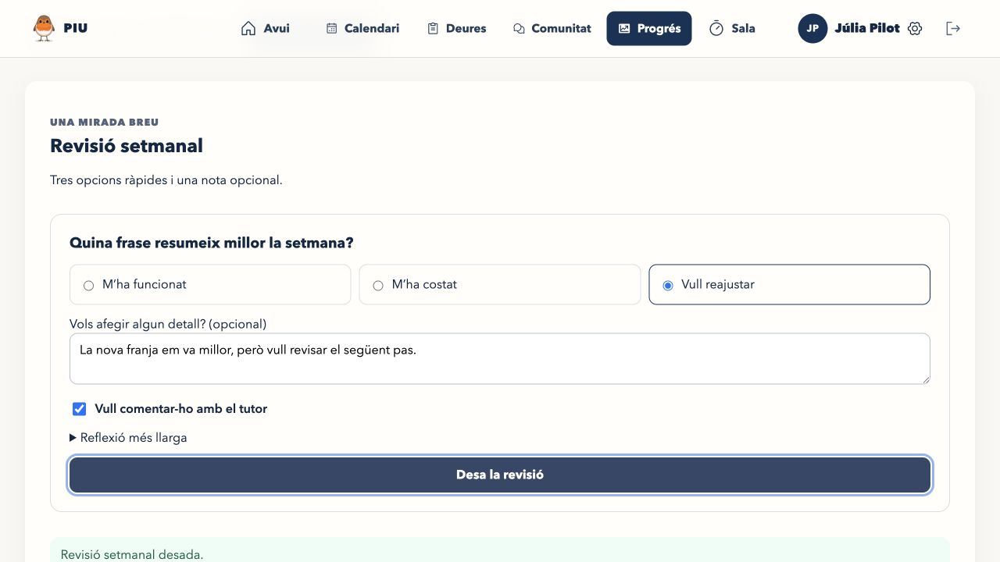

## Accessibilitat comprovada i límits

- El diàleg de sortida rep el focus inicial i es pot tancar amb `Escape`.
- No s'han detectat botons sense nom, camps sense etiqueta, imatges sense text alternatiu ni identificadors duplicats en la pantalla de revisió inspeccionada.
- El codi inclou tractament de moviment reduït, però falta validar-lo amb la preferència real del sistema activada.
- No es pot afirmar encara compatibilitat completa amb teclat, VoiceOver ni zoom al 200%: aquestes proves s'han de fer manualment en dispositius reals.

## Pla del pilot pendent

1. Fer una sessió curta amb un grup petit: apuntar una tasca, planificar-la i trobar el següent pas sense explicació del tutor.
2. Cronometrar i observar `Planifica la setmana en 2 minuts` sense ajudar durant el recorregut.
3. Fer el pilot durant 6–8 setmanes i recollir incidències i comentaris per pantalla i per flux.
4. Classificar cada element com a `mantenir`, `modificar` o `eliminar` abans d'ampliar l'eina.

## Criteri de sortida

Es pot començar el pilot quan s'hagin completat la prova física d'iPad/Safari i la passada manual d'accessibilitat. Les decisions finals del bloc 20 només es podran tancar després del pilot amb alumnes.
